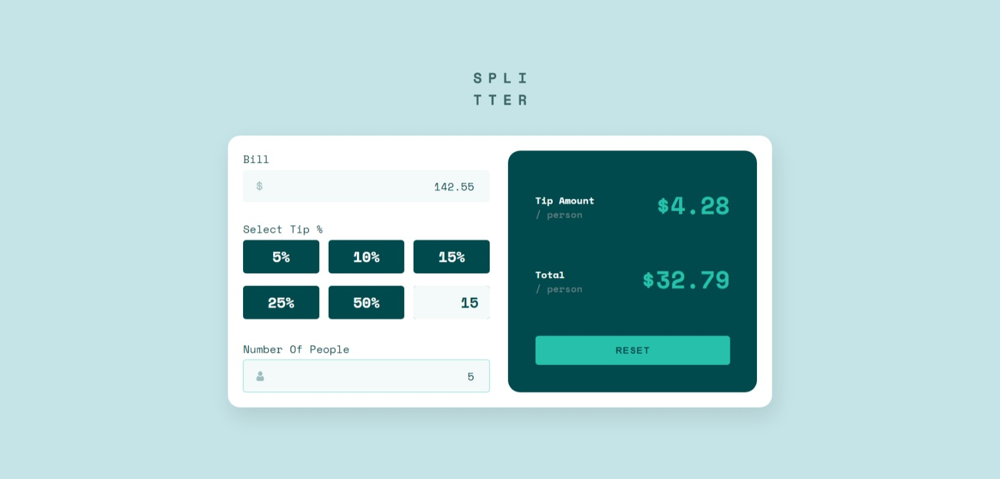
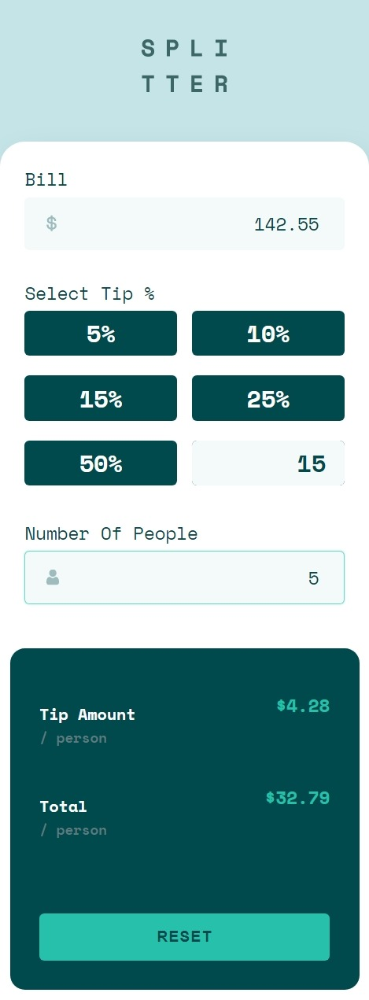

# Frontend Mentor - Tip Calculator App


This is a solution to the [Tip Calculator App challenge on Frontend Mentor](https://www.frontendmentor.io/challenges/tip-calculator-app-ugJNGbJUX). Frontend Mentor challenges help you improve your coding skills by building realistic projects.

## Table of contents

-   [Overview](#overview)
    -   [The Challenge & Functionalities](#the-challenge-&-functionalities)
    -   [Screenshots](#screenshots)
    -   [Links](#links)
-   [My process](#my-process)
    -   [Built with](#built-with)
    -   [What I learned](#what-i-learned)
    -   [Useful resources](#useful-resources)
-   [Author](#author)

## Overview

### The Challenge & Functionalities

Users should be able to:

-   View the optimal layout for the app depending on their device's screen size.
-   See hover states for all interactive elements on the page.
-   Calculate the tip amount per person.
-   Calculate the total cost of the bill per person.
-   Select percentages which are already defined or select his personal percentage tip.

### Screenshots




### Links

-   Solution URL: [Frontend Mentor](https://www.frontendmentor.io/solutions/tip-calculator-app-0q3v_mo9Ae/)
-   Live Site URL: [Github Pages](https://philopaterhany.github.io/Tip-Calculator/)

## My process

### Built with

-   Semantic HTML5 Markup
-   CSS Custom Properties
-   CSS Flexbox
-   Vanilla JS + ES6

### What I learned

```css
/* Removing Arrows From Input Number */
/* Chrome, Safari, Edge, Opera */
input::-webkit-outer-spin-button,
input::-webkit-inner-spin-button {
    -webkit-appearance: none;
    margin: 0;
}
/* Firefox */
input[type="number"] {
    -moz-appearance: textfield;
}
```

```js
// Prevent Writing [- + e] in Inputs
document.querySelectorAll('input[type="number"]').forEach((input) => {
    input.addEventListener("keypress", function (e) {
        if (["-", "+", "e"].includes(e.key)) e.preventDefault();
    });
});

// Formatting Currency Function
function formatCurrency(value) {
    return value.toLocaleString("en-US", {
        style: "currency",
        currency: "USD",
    });
}
```

### Useful Resources

-   [MDN: <small> HTML Element](https://developer.mozilla.org/en-US/docs/Web/HTML/Element/small)
-   [MDN: Number.toLocaleString()](https://developer.mozilla.org/en-US/docs/Web/JavaScript/Reference/Global_Objects/Number/toLocaleString)
-   [MDN: Node.parentElement](https://developer.mozilla.org/en-US/docs/Web/API/Node/parentElement)
-   [W3S: Hide Arrows](https://www.w3schools.com/howto/howto_css_hide_arrow_number.asp)

## Author

-   Website - Portfolio Is Coming Out Soon!
-   Frontend Mentor - [@PhilopaterHany](https://www.frontendmentor.io/profile/PhilopaterHany/)
-   Twitter - [@PhilopaterHany4](https://www.twitter.com/PhilopaterHany4/)
-   Facebook - [Philopater Hany](https://www.facebook.com/philopater.hany.3)
-   Discord - [#8178](https://discord.com/#8178/)
